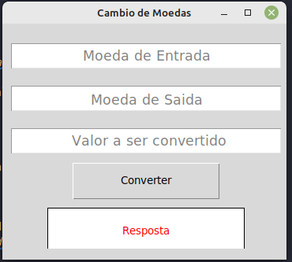

## Projeto Conversor de Moedas utilizando Tkinter e Api da awesomeapi.com.br

### Descrição
- [x] Criar uma aplicação que converta moedas utilizando a api da awesomeapi.com.br
- [x] Criar uma interface gráfica utilizando Tkinter

### Imagens da Aplicação

### Tecnologias Utilizadas
- [x] Python
- [x] Tkinter
- [x] Api

### Como executar o projeto
- [x] Baixe o projeto
- [x] Abra o terminal na pasta do projeto
- [x] Execute o comando `python3 main.py`

